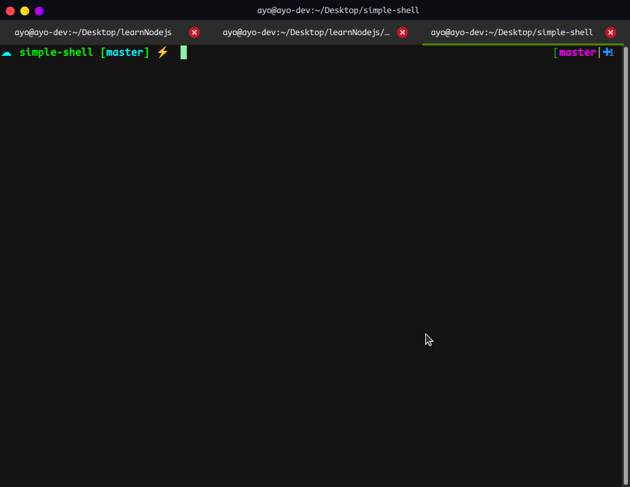
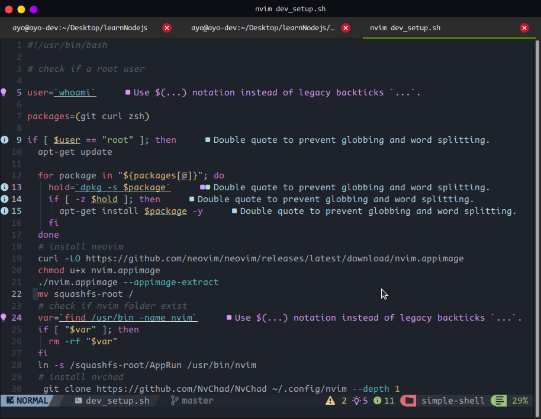

## Pro Terminal Setup

### Terminal Preview



### Vim Preview



### Download Installation Scripts

```sh
wget https://github.com/Ayobami6/simple-shell/raw/master/dev_setup.sh
```

### Plugins

```sh
wget https://github.com/Ayobami6/simple-shell/raw/master/plugins.sh
```

```sh
chmod 555 dev_setup.sh plugins.sh
```

### Run

```sh
./dev_setup.sh
./plugins.sh
```

```sh
source ~/.zshrc
```

### Install Nerd Fonts

```sh
wget https://github.com/ryanoasis/nerd-fonts/raw/master/patched-fonts/CodeNewRoman/Regular/CodeNewRomanNerdFont-Regular.otf
```
